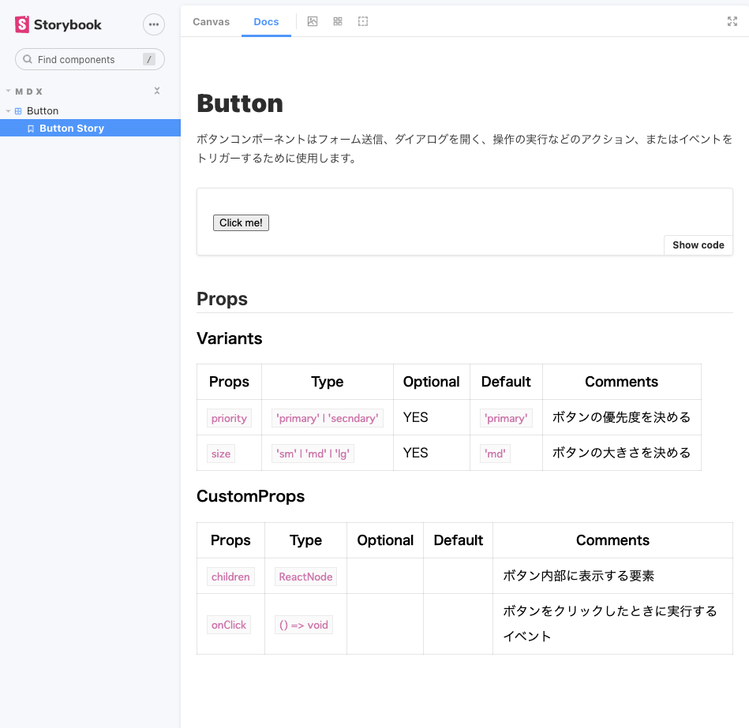

# Storybook Props Document Generator

コンポーネントの型エイリアス（Type Alias）からStorybook用のPropsドキュメントを生成するサンプルリポジトリです。



## 使い方

1. コンポーネント内にPropsの型情報を追加する
    ```typescript
    /**
     * デザインツール上の設定
     */
    type Variants = {
      /**
       * ボタンの優先度を決める
       * @default 'primary'
       */
      priority?: 'primary' | 'secndary'
      /**
       * ボタンの大きさを決める
       * @default 'md'
       */
      size?: 'sm' | 'md' | 'lg'
    }
 
    /**
     * 技術的に必要なProps、または明示的に受け取るAttributes
     */
    type CustomProps = {
      /**
       * ボタン内部に表示する要素
       */
      children: ReactNode
      /**
       * ボタンをクリックしたときに実行するイベント
       */
      onClick: () => void
    }
    ```
2. propsdocgenの`propsdocgen.config.ts`を設定する
    ```typescript
    import type { Config } from '.'

    export const config: Config = {
      targets: ['Variants', 'CustomProps'],
      jsDoc: ['default'],
      include: ['components/**/*.tsx'],
      exclude: [
        'components/**/index.tsx',
        'components/**/_*',
        'components/**/*spec*',
        'components/**/*stories*',
        'components/**/use*',
      ],
      filename: '.props.json'
    }
    ```
3. `npm run build:propsdocs`を実行し、`xxx.props.json`を生成する
4. `xxx.stories.mdx`でProps用コンポーネント（`<PropsDocs>`）を使いドキュメントを書く
    ```mdx
    import { PropsDocs } from '../../scripts/propsdocgen/PropsDocs'
    import ButtonPropsDoc from './Button.props.json'

    ...

    ## Props

    <PropsDocs json={ButtonPropsDoc}></PropsDocs>
    ```
 